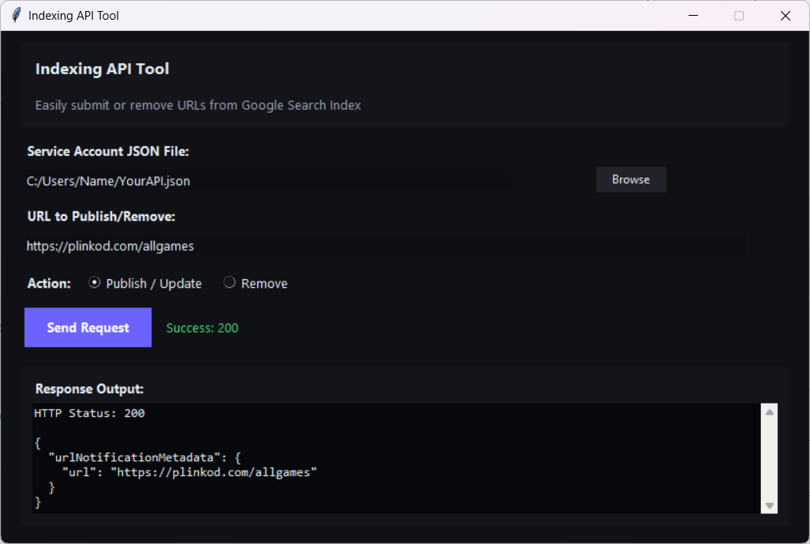

# Google Indexing API Tool

A simple Python GUI application to interact with the Google Indexing API. This tool allows you to instantly request Google to crawl (publish/update) or remove URLs from the search index.  
It was originally created to help automate indexing for several personal projects and platforms, including tools used on websites like [Plinkod.com](https://plinkod.com/allgames), where fast indexing can be especially useful for new content pages.

## Preview


## Features
- **User-Friendly GUI**: Built with Tkinter for easy interaction.
- **Dark Mode**: Modern dark theme interface.
- **Bulk Actions**: (Planned) Support for multiple URLs.
- **Secure**: Uses your own Google Service Account JSON key.

## Prerequisites
- Python 3.x
- A Google Cloud Service Account with the **Indexing API** enabled.
- A JSON key file for your Service Account.

## Installation

1. Clone the repository:
   ```bash
   git clone https://github.com/yourusername/google-indexing-api-tool.git
   cd google-indexing-api-tool
   ```

2. Install dependencies:
   ```bash
   pip install -r requirements.txt
   ```

## Usage

1. Run the application:
   ```bash
   python google-index-api.py
   ```

2. **Select Service Account**: Click "Browse" to select your `service-account.json` file.
3. **Enter URL**: Paste the URL you want to index or remove.
4. **Choose Action**: Select "Publish / Update" or "Remove".
5. **Send**: Click "Send Request" and wait for the response.

## Important Note
**Security Warning**: Never share your `service-account.json` file or commit it to a public repository. It contains sensitive credentials that grant access to your Google Cloud project.

## License
MIT License
